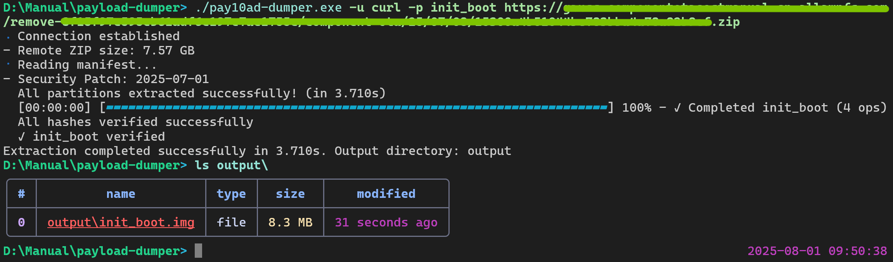

# Pay10ad Dumper

Feature-rich Android OTA payload dumper written in Rust.

> What is Payload?
> Android payload is a file that contains ROM partitions like boot, system, vendor and others. Payload Dumper extracts these partitions from the `payload.bin` file.

## 🪄 Features

- Extract partitions **selectively** (Specify via `-p`/`--partitions`)
- Extract from local `payload.bin` or ROM **zip** file without decompressing the whole archive
- Extract from **HTTP(S) URL** (`payload.bin` or zip) without downloading the whole file (Need server support)
- Verify output partitions
- Parallelism to maximize speed (Customizable via `--no-parallel`/`--threads`)
- Tiny: < 1M compressed on all common platforms (Windows, MacOS, Linux)

## 📥 Installation

### Using [`binstall`](https://github.com/cargo-bins/cargo-binstall)

```shell
cargo binstall pay10ad-dumper
```

### Downloading from Releases

Navigate to the [Releases page](https://github.com/PRO-2684/pay10ad-dumper/releases) and download respective binary for your platform. Make sure to give it execute permissions.

### Compiling from Source

```shell
cargo install pay10ad-dumper
```

## 📖 Usage

### Common Usage

- Extract all partitions from `payload.bin`: `pay10ad-dumper payload.bin`
- List partitions from `ota.zip`: `pay10ad-dumper -l ota.zip`
- Extract `boot` & `init_boot` from `<URL>`: `pay10ad-dumper -p boot -p init_boot <URL>`

<details><summary>

📸 Screenshot of `pay10ad-dumper` extracting `init_boot.img` from an online OTA zip file with specified UA

</summary>



</details>

<details><summary>

📸 Screenshot of `pay10ad-dumper` listing partitions from local `payload.bin`

</summary>


</details>

<details><summary>

📸 Screenshot of `pay10ad-dumper` listing partitions from remote `ota.zip`

</summary>


</details>

### CLI Reference

```shell
$ pay10ad-dumper --help
Usage: pay10ad-dumper <payload_path> [-o <out>] [--diff] [--old <old>] [--partitions <partitions...>] [--threads <threads>] [--list] [--metadata] [--no-parallel] [--no-verify] [-u <user-agent>]

Feature-rich Android OTA payload dumper written in Rust

Positional Arguments:
  payload_path      path or URL to your payload

Options:
  -o, --out         output directory for extracted partitions
  --diff            enable differential OTA mode (requires --old)
  --old             path to the directory containing old partition images
                    (required for --diff)
  --partitions      list of partition names to extract
  --threads         number of threads to use for parallel processing
  --list            list available partitions in the payload
  --metadata        save complete metadata as JSON (use --out - to write to
                    stdout)
  --no-parallel     disable parallel extraction
  --no-verify       skip hash verification
  -u, --user-agent  the User-Agent to use if extracting from URL (Defaults to a
                    representative browser UA)
  --help, help      display usage information
```

## 🤔 Comparison

| Project | Lang | Zip | URL | URL + zip | Size |
| - | - | - | - | - | - |
| [`vm03/payload_dumper`](https://github.com/vm03/payload_dumper) | 🐍 Python | 🔴 | 🔴 | 🔴 | N/A |
| [`5ec1cff/payload-dumper`](https://github.com/5ec1cff/payload-dumper) | 🐍 Python | 🟢 | 🟢 | 🟡 | N/A |
| [`payload-dumper-go`](https://github.com/ssut/payload-dumper-go) | 🐹 Go | 🟢 | 🔴 | 🔴 | ≈5.5M |
| [`payload-dumper-rust`](https://github.com/rhythmcache/payload-dumper-rust) | 🦀 Rust | 🟢 | 🟢 | 🟢 | ≈3.5M |
| [`pay10ad-dumper`](https://github.com/PRO-2684/pay10ad-dumper) | 🦀 Rust | 🟢 | 🟢 | 🟢 | ≈2M |

Additional explanation:

- Heading
    - `Zip`: Whether it supports extracting partitions from ZIP archives without decompressing it first.
    - `URL`: Whether it supports extracting partitions from `payload.bin` URLs without downloading the whole file.
    - `URL + Zip`: Whether it supports extracting partitions from `ota.zip` URLs without downloading the whole file.
    - `Size`: Executable size on Linux, decompressed.
- Values
    - `🔴`: No
    - `🟢`: Yes
    - `🟡`: Not tested

## 🛣️ Todo

- [ ] Async
- [ ] Better errors
- [x] Use another CLI parser
- [ ] Customize HTTP headers

## 🎉 Credits

- Forked from [rhythmcache/payload-dumper-rust](https://github.com/rhythmcache/payload-dumper-rust) to scratch my own itch (Set User-Agent)
